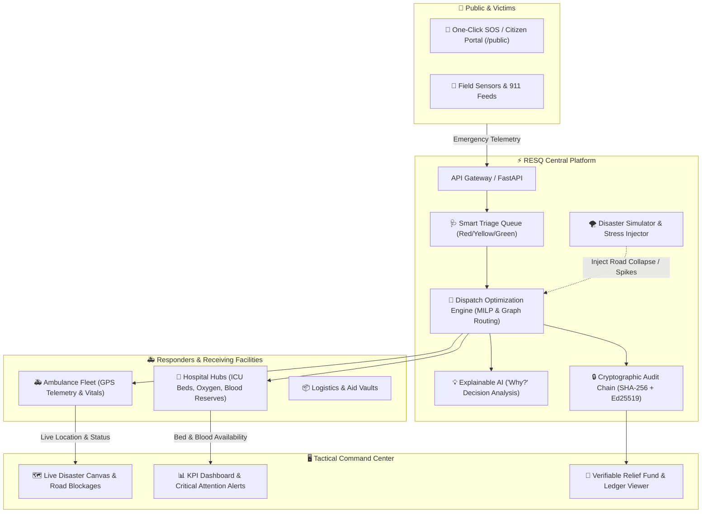
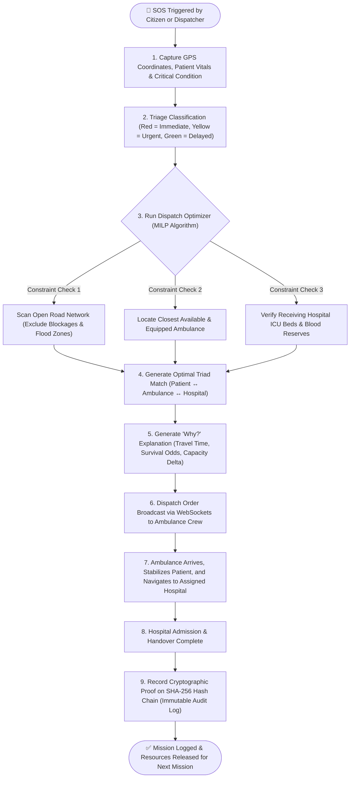
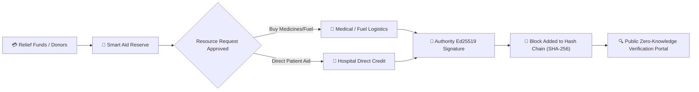

# 🚨 RESQ — Intelligent Disaster Relief & Emergency Response Center

> **Real-time, AI-optimized dispatch and cryptographically verifiable resource allocation for disaster zones.**

[](https://github.com/)
[](https://reactjs.org/)
[](https://fastapi.tiangolo.com/)
[](https://developers.google.com/optimization)
[](https://en.wikipedia.org/wiki/Hash_chain)

---

## 📌 Project Overview (In Simple Words)

When a major disaster strikes (earthquake, flood, explosion), emergency services are overwhelmed:
- Phone lines jam, and emergency responders don't know who needs help first.
- Ambulances get stuck on collapsed roads or carry patients to overcrowded hospitals.
- Supplies and emergency relief funds get delayed or lost without accountability.

**RESQ is a smart, unified command center that connects victims, ambulances, hospitals, and relief resources.** 

1. **Assesses urgency** (Triage: Red / Yellow / Green).
2. **Finds the best path and match** using an AI/MILP optimization engine that factors in blocked roads, hospital bed capacity, and specialized equipment (ICU, burn care, blood reserves).
3. **Explains every decision** with built-in Explainable AI (XAI: *"Why was Hospital B chosen over Hospital A?"*).
4. **Locks every action into a tamper-proof cryptographic ledger** so relief funds and medical supplies are 100% auditable and corruption-free.

---

## 🔄 System Architecture (Flowchart)



---

## ⚡ End-to-End Emergency Response Lifecycle (Flowchart)

This flowchart illustrates what happens from the moment an SOS is triggered until the patient is safely admitted to the right hospital:



---

## 💸 Transparent Relief Fund & Supply Chain Flowchart

RESQ eliminates relief black markets and misallocations by chaining every dollar and medical item cryptographically:



---

## 🖥️ Operational Modules & Routes

| Screen / Route | Purpose | Key Features |
| :--- | :--- | :--- |
| **`/overview`** | Command HQ | 5-Column operational KPI strip, critical triage queue, active alerts. |
| **`/live`** | Live Tactical Canvas | Interactive vector map with ambulances, blocked roads, and evacuation corridors. |
| **`/patients`** | Triage Queue | Patient list filtered by severity (Red/Yellow/Green), vitals, and wait times. |
| **`/ambulances`** | Fleet Telemetry | Real-time GPS coordinates, crew readiness, onboard equipment, and route status. |
| **`/hospitals`** | Receiving Hubs | ICU bed occupancy, emergency room surge status, and surgical unit availability. |
| **`/resources`** | Logistics & Blood Bank | Blood supply readiness (A+/O-/B+), oxygen cylinder counts, emergency medicines. |
| **`/allocations`** | AI Dispatch & XAI | Multi-objective match table with the **"Why?" drawer** explaining decisions. |
| **`/ledger`** | Cryptographic Audit | SHA-256 chained transaction log with tamper alerts and digital signatures. |
| **`/funds`** | Relief Fund Flow | End-to-end tracing of donor contributions to frontline resource consumption. |
| **`/simulator`** | Chaos & Stress Testing | Inject earthquake aftershocks, bridge collapses, or blackouts to test system response. |
| **`/analytics`** | Benchmark Analytics | Algorithmic comparison (RESQ MILP vs. Greedy Nearest vs. FIFO). |
| **`/public`** | Citizen Emergency Portal | Clean mobile-first interface for public SOS triggers, safe zones, and bulletins. |

---

## 🛠️ Technology Stack

```
Frontend:
  ├── React 18+ & TypeScript
  ├── Vite (Lightning-fast dev build)
  ├── Tailwind CSS (Stitch Operational Clarity Design System)
  ├── React Leaflet & Tactical Canvas
  ├── Lucide React & Material Symbols
  └── Zustand (Reactive state store)

Backend & Engine:
  ├── Python 3.11+ & FastAPI
  ├── NetworkX & OSMnx (Dynamic graph-based road networks)
  ├── Google OR-Tools (Mixed-Integer Linear Programming / Simplex Dispatch)
  └── WebSockets (Live telemetry and dispatch updates)

Verification & Ledger:
  ├── SHA-256 Hash Chaining
  ├── Ed25519 Cryptographic Signatures
  └── Zero-Knowledge PII Sanitization
```

---

## 🚀 Quickstart Guide

### Prerequisites
- **Node.js** (v18 or higher)
- **npm** or **yarn**
- **Python** (3.11+ optional, for backend/engine)

---

### Step 1: Run Frontend (Tactical Command Center)

```bash
# Navigate to the frontend directory
cd frontend

# Install dependencies
npm install

# Launch development server
npm run dev
```

Open your browser at:
- **Operations Command Center**: `http://localhost:5173/overview`
- **Citizen SOS Portal**: `http://localhost:5173/public`

---

### Step 2: Run Backend & Optimization API (Optional)

```bash
# Open a new terminal and navigate to backend
cd backend

# Install Python requirements
pip install -r requirements.txt

# Run FastAPI server
python app/main.py
```

- API Server: `http://localhost:8000`
- Interactive API Docs (Swagger): `http://localhost:8000/docs`

---

## 📂 Repository Directory Layout

```text
RESQ/
├── frontend/             # Complete React 18 + TypeScript + Tailwind UI
│   ├── src/
│   │   ├── components/   # UI components (Map, Triage, Fleet, Ledger, etc.)
│   │   ├── pages/        # 15 Operational routes (Overview, Live, Public, etc.)
│   │   ├── layouts/      # Control Room & Public Portal layouts
│   │   ├── stores/       # Zustand reactive state store
│   │   └── types/        # TypeScript emergency domain interfaces
│   ├── package.json
│   └── vite.config.ts
│
├── backend/              # FastAPI routes, schemas, and WebSocket server
│   ├── app/
│   └── requirements.txt
│
├── engine/               # MILP optimizer, graph routing & scoring algorithms
│   ├── optimizer.py      # OR-Tools resource dispatch formulation
│   ├── routing.py        # Graph routing avoiding blocked roads
│   ├── scoring.py        # Urgency & survival scoring
│   └── baselines.py      # Greedy and FIFO comparison models
│
├── ledger/               # Cryptographic audit & verification chain
│   ├── chain.py          # SHA-256 block chain implementation
│   ├── signing.py        # Ed25519 digital signature signing/verifying
│   └── verify.py         # Integrity validation & tampering detection
│
├── simulator/            # Disaster scenario generation & disruptor events
├── database/             # Database migrations and seed scripts
└── docker-compose.yml    # Containerized deployment orchestration
```
